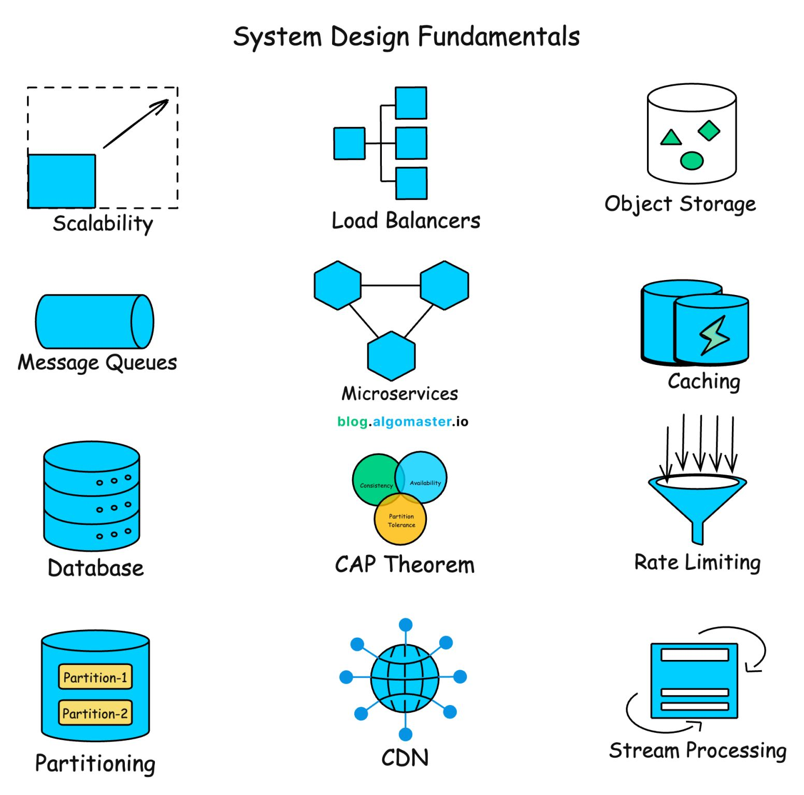

# System Design Concepts

1. [**API**](https://blog.algomaster.io/p/whats-an-api)
   - **Definition**: Application Programming Interface, a set of rules allowing different software entities to communicate.
   - **Key Concepts**: Endpoints, Request/Response, Headers, Status Codes, Contracts.
   - **Use Cases**: Integrating third-party services, Microservices communication, Frontend-Backend interaction.
   - **Trade-offs**: Versioning complexity, Latency overhead.

2. [**API Gateway**](https://blog.algomaster.io/p/what-is-an-api-gateway)
   - **Definition**: Single entry point for client requests, routing them to appropriate microservices.
   - **Key Concepts**: Routing, Authentication, Rate Limiting, Protocol Translation, SSL Termination.
   - **Use Cases**: Microservices architectures, Public API management, Security enforcement.
   - **Trade-offs**: Single point of failure (if not HA), Added latency, Potential bottleneck.

3. [**JSON Web Tokens**](https://blog.algomaster.io/p/json-web-tokens)
   - **Definition**: Compact, URL-safe means of representing claims to be transferred between two parties.
   - **Structure**: Header, Payload, Signature.
   - **Use Cases**: Stateless Authentication, Authorization, Information Exchange.
   - **Trade-offs**: Token size (bandwidth), Revocation difficulty (requires blocklist or short expiry).

4. [**Webhooks**](https://blog.algomaster.io/p/what-are-webhooks)
   - **Definition**: User-defined HTTP callbacks triggered by specific events.
   - **Key Concepts**: Event-driven, Push model (vs Pull/Polling).
   - **Use Cases**: Payment confirmations (Stripe), CI/CD pipelines, Real-time notifications.
   - **Trade-offs**: Security (verification needed), Reliability (retries required), Ordering not guaranteed.

5. [**Load Balancing**](https://blog.algomaster.io/p/load-balancing-algorithms-explained-with-code)
   - **Definition**: Distributing network traffic across multiple servers to ensure reliability and performance.
   - **Algorithms**: Round Robin, Least Connections, IP Hash, Weighted Round Robin.
   - **Use Cases**: High traffic websites, Horizontal scaling, Redundancy/Failover.
   - **Trade-offs**: Complexity, Session persistence challenges (Sticky sessions).

6. [**Proxy vs Reverse Proxy**](https://blog.algomaster.io/p/proxy-vs-reverse-proxy-explained)
   - **Definition**: Forward Proxy acts on behalf of client; Reverse Proxy acts on behalf of server.
   - **Key Concepts**: Anonymity (Forward), Load Balancing/Caching/Security (Reverse).
   - **Use Cases**: Corporate firewalls (Proxy), CDN/Gateway (Reverse Proxy).
   - **Trade-offs**: Added hop latency, Configuration complexity.

7. [**Scalability**](https://blog.algomaster.io/p/scalability)
   - **Definition**: System's ability to handle growing amount of work.
   - **Types**: Vertical (Scale Up - stronger hardware) vs Horizontal (Scale Out - more nodes).
   - **Use Cases**: Handling traffic spikes, Growing user base, Data growth.
   - **Trade-offs**: Cost (Vertical is expensive/limited), Complexity (Horizontal requires distributed logic).

8. [**Availability**](https://blog.algomaster.io/p/system-design-what-is-availability)
   - **Definition**: Proportion of time a system is functional and accessible.
   - **Key Concepts**: Nines (99.9%), SLAs, Redundancy, Failover, MTTR/MTBF.
   - **Use Cases**: Critical systems (Banking, Healthcare, E-commerce).
   - **Trade-offs**: Cost of redundancy vs Cost of downtime.

9. [**Single Point of Failure**](https://blog.algomaster.io/p/system-design-how-to-avoid-single-point-of-failures)
   - **Definition**: Part of a system that, if it fails, stops the entire system from working.
   - **Mitigation**: Redundancy, Diversity, Isolation.
   - **Use Cases**: Identifying risks in architecture diagrams.
   - **Trade-offs**: Redundancy increases cost and complexity.

10. [**CAP Theorem**](https://blog.algomaster.io/p/cap-theorem-explained)
    - **Definition**: Distributed data store can only guarantee two of three: Consistency, Availability, Partition Tolerance.
    - **Key Concepts**: CP (Consistency/Partition Tolerance), AP (Availability/Partition Tolerance).
    - **Use Cases**: Database selection (Cassandra vs MongoDB vs RDBMS).
    - **Trade-offs**: Must choose between strong consistency and high availability during partitions.

11. [**SQL vs NoSQL**](https://blog.algomaster.io/p/sql-vs-nosql-7-key-differences)
    - **Definition**: Relational (Structured) vs Non-relational (Flexible) databases.
    - **Key Differences**: ACID vs BASE, Schema vs Schemaless, Joins vs Denormalization.
    - **Use Cases**: Complex queries/Transactions (SQL), Big Data/Rapid prototyping (NoSQL).
    - **Trade-offs**: Consistency vs Scalability/Flexibility.

12. [**ACID Transactions**](https://blog.algomaster.io/p/what-are-acid-transactions-in-databases)
    - **Definition**: Properties ensuring reliable database transactions.
    - **Acronym**: Atomicity, Consistency, Isolation, Durability.
    - **Use Cases**: Financial systems, Inventory management, Order processing.
    - **Trade-offs**: Performance overhead due to locking/logging, Reduced scalability.

13. [**Database Indexes**](https://blog.algomaster.io/p/a-detailed-guide-on-database-indexes)
    - **Definition**: Data structure improving speed of data retrieval operations.
    - **Types**: B-Tree, Hash Index, Composite Index, Bitmap.
    - **Use Cases**: Optimizing read-heavy queries.
    - **Trade-offs**: Slower writes (update index), Storage overhead.

14. [**Database Sharding**](https://blog.algomaster.io/p/what-is-database-sharding)
    - **Definition**: Horizontal partitioning of data across multiple databases/machines.
    - **Techniques**: Range Based, Hash Based, Directory Based.
    - **Use Cases**: Massive datasets exceeding single node capacity.
    - **Trade-offs**: Complex queries (Joins across shards), Rebalancing difficulty.

15. [**Consistent Hashing**](https://blog.algomaster.io/p/consistent-hashing-explained)
    - **Definition**: Hashing technique where resizing the hash table requires remapping only K/n keys.
    - **Key Concepts**: Hash Ring, Virtual Nodes.
    - **Use Cases**: Distributed Caching, Load Balancing, Sharding.
    - **Trade-offs**: Implementation complexity vs Uniform distribution benefits.

16. [**Change Data Capture**](https://blog.algomaster.io/p/change-data-capture-cdc)
    - **Definition**: Pattern to identify and track changes in data so action can be taken.
    - **Methods**: Log-based (WAL), Trigger-based, Polling.
    - **Use Cases**: ETL pipelines, Cache invalidation, Search indexing sync, Data replication.
    - **Trade-offs**: Latency, Storage impact on source DB.

17. [**Caching**](https://blog.algomaster.io/p/4d7d6f8a-6803-4c7b-85ca-864c87c2cbf2)
    - **Definition**: Storing copies of data in temporary storage for faster access.
    - **Key Concepts**: Hit/Miss ratio, TTL, Eviction.
    - **Use Cases**: Reducing DB load, Improving API latency, Storing session data.
    - **Trade-offs**: Data consistency (Stale data), Memory cost.

18. [**Caching Strategies**](https://blog.algomaster.io/p/top-5-caching-strategies-explained)
    - **Definition**: Patterns for reading/writing data to cache.
    - **Strategies**: Cache-Aside, Read-Through, Write-Through, Write-Back, Write-Around.
    - **Use Cases**: Optimizing for read-heavy vs write-heavy workloads.
    - **Trade-offs**: Complexity of implementation vs Performance gains.

19. [**Cache Eviction Strategies**](https://blog.algomaster.io/p/7-cache-eviction-strategies)
    - **Definition**: Algorithms to decide which items to remove when cache is full.
    - **Algorithms**: LRU (Least Recently Used), LFU (Least Frequently Used), FIFO, LIFO, RR.
    - **Use Cases**: Managing limited memory resources efficiently.
    - **Trade-offs**: Overhead of tracking usage vs Hit rate optimization.

20. [**CDN**](https://blog.algomaster.io/p/content-delivery-networks)
    - **Definition**: Geographically distributed network of proxy servers.
    - **Key Concepts**: Edge locations, Origin server, PoP (Point of Presence).
    - **Use Cases**: Serving static assets (Images, CSS, JS), Video streaming, Reducing latency.
    - **Trade-offs**: Cost, Cache invalidation complexity.

21. [**Rate Limiting**](https://blog.algomaster.io/p/rate-limiting-algorithms-explained-with-code)
    - **Definition**: Controlling the rate of traffic sent or received by a network interface controller.
    - **Algorithms**: Token Bucket, Leaky Bucket, Fixed Window, Sliding Window Log/Counter.
    - **Use Cases**: API protection, DDoS prevention, Fair usage enforcement.
    - **Trade-offs**: User experience (throttling), State management overhead.

22. [**Message Broker**](https://blog.algomaster.io/p/message-queues)
    - **Definition**: Intermediary that translates messages between sender and receiver protocols.
    - **Key Concepts**: Pub/Sub, Queues, Topics, Producers, Consumers.
    - **Use Cases**: Decoupling microservices, Asynchronous processing, Load leveling.
    - **Trade-offs**: Complexity, Message ordering/delivery guarantees.

23. [**Bloom Filter**](https://blog.algomaster.io/p/bloom-filters)
    - **Definition**: Probabilistic data structure testing whether an element is a member of a set.
    - **Key Concepts**: False positives (possible), False negatives (impossible), Hash functions.
    - **Use Cases**: Cache filtering, Database query optimization, Crawler duplicate detection.
    - **Trade-offs**: No deletion (standard), Probability of error.

24. [**Idempotency**](https://blog.algomaster.io/p/idempotency-in-distributed-systems)
    - **Definition**: Property where applying an operation multiple times has the same effect as applying it once.
    - **Key Concepts**: Idempotency Keys, Safe Retries.
    - **Use Cases**: Payment processing, Network retries, Distributed systems consistency.
    - **Trade-offs**: Storage for keys, Logic complexity.

25. [**Concurrency vs Parallelism**](https://blog.algomaster.io/p/concurrency-vs-parallelism)
    - **Definition**: Concurrency is dealing with multiple things at once; Parallelism is doing multiple things at once.
    - **Key Concepts**: Context Switching, Threads vs Multi-core execution.
    - **Use Cases**: I/O bound (Concurrency), CPU bound (Parallelism).
    - **Trade-offs**: Synchronization overhead (Locks, Race conditions).

26. [**Stateful vs Stateless Architecture**](https://blog.algomaster.io/p/stateful-vs-stateless-architecture)
    - **Definition**: Stateful retains session data; Stateless treats each request independently.
    - **Key Concepts**: Session Store, Horizontal Scaling.
    - **Use Cases**: Real-time games (Stateful), REST APIs (Stateless).
    - **Trade-offs**: Scaling difficulty (Stateful) vs Data overhead per request (Stateless).

27. [**Long Polling vs WebSockets**](https://blog.algomaster.io/p/long-polling-vs-websockets)
    - **Definition**: Techniques for real-time communication.
    - **Key Concepts**: Polling (Request-Wait-Response), WebSockets (Full-duplex persistent connection).
    - **Use Cases**: Chat apps, Live feeds, Notifications.
    - **Trade-offs**: Connection overhead (WebSockets) vs Latency/Server load (Polling).

28. [**Batch Processing vs Stream Processing**](https://blog.algomaster.io/p/batch-processing-vs-stream-processing)
    - **Definition**: Processing data in chunks (Batch) vs item-by-item in real-time (Stream).
    - **Key Concepts**: MapReduce, ETL vs Kafka Streams, Flink.
    - **Use Cases**: Payroll/Reports (Batch), Fraud Detection/Monitoring (Stream).
    - **Trade-offs**: Latency (Batch is high) vs Complexity (Stream is high).

29. [**Strong vs Eventual Consistency**](https://blog.algomaster.io/p/strong-vs-eventual-consistency)
    - **Definition**: Immediate visibility of updates (Strong) vs Updates propagate over time (Eventual).
    - **Key Concepts**: Linearizability vs Convergence.
    - **Use Cases**: Banking (Strong), Social Media Feeds (Eventual).
    - **Trade-offs**: Latency/Availability (Strong suffers) vs Data freshness (Eventual suffers).

30. [**REST vs GraphQL**](https://blog.algomaster.io/p/rest-vs-graphql)
    - **Definition**: Architectural style for APIs (REST) vs Query language for APIs (GraphQL).
    - **Key Concepts**: Resources/Verbs (REST) vs Schema/Resolvers (GraphQL).
    - **Use Cases**: Public APIs/Caching (REST), Flexible client requirements (GraphQL).
    - **Trade-offs**: Over-fetching/Under-fetching (REST) vs Complexity/Caching difficulty (GraphQL).
