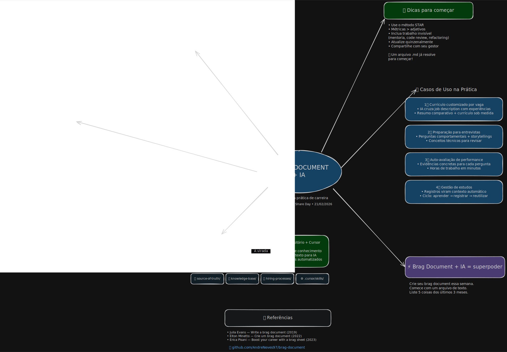

# Tech Leads Club Share Day — Brag Document + IA

> **Uma estratégia prática de carreira**
>
> **André Neves** — TCL Share Day, 21/02/2026

Este repositório contém o material de apoio da palestra sobre como transformar o "Brag Document" tradicional em um repositório vivo, estruturado e potencializado por IA (Cursor).

## 📝 O que é um Brag Document?

Documento vivo onde você registra conquistas, contribuições e impacto profissional ao longo do tempo.

- Popularizado por **Julia Evans** (2019)
- Difundido no Brasil por **Elton Minetto** (2022)

## ❓ Por que manter um?

1. 🧠 **Você não lembra de tudo** (e seu gestor também não)
2. ⏰ **Viés de recência** — Avaliações tendem a refletir apenas as últimas semanas de trabalho
3. 🔄 **Transições de gestão** — Novo gestor muitas vezes significa um "reset" na sua visibilidade
4. 💪 **Síndrome do impostor** — Abra o documento e veja as evidências concretas do seu valor

## 🔄 A Evolução: Do Notion ao Cursor

### 📋 Antes (Notion/Docs)
Informações dispersas e estáticas:
- Dicas de carreira soltas
- Guia para entrevistas desatualizado
- Anotações de jornada sem conexão

### 💻 Depois (Repositório + Cursor)
Uma base de conhecimento estruturada que serve de **contexto** para a IA:
- 📁 `source-of-truth/`: Dados canônicos (experiência, perfil)
- 📚 `contents/`: Base de conhecimento técnica
- 💼 `hiring-processes/`: Gestão de processos seletivos
- ⚙️ `.cursor/rules/`: Instruções para o Agente

## 🛠️ Casos de Uso na Prática

Com a estrutura montada, o Agente de IA pode gerar:

1. **Currículo customizado por vaga** — Cruza job description com suas experiências para criar um CV sob medida.
2. **Preparação para entrevistas** — Gera perguntas comportamentais baseadas na sua história e sugere revisões técnicas.
3. **Auto-avaliação de performance** — Busca evidências em todo o histórico para preencher formulários de avaliação em minutos.
4. **Gestão de estudos** — O ciclo virtuoso: aprender → registrar → reutilizar como contexto.

## ✅ Dicas para começar

- **Use o método STAR** (Situação, Tarefa, Ação, Resultado)
- **Métricas > Adjetivos** (Quantifique o impacto)
- **Inclua trabalho invisível** (Mentoria, code review, refactoring, on-call)
- **Atualize quinzenalmente** (Crie o hábito)
- **Compartilhe com seu gestor** (Facilite o trabalho dele)

💡 **Não precisa complicar:** Um arquivo Markdown (`.md`) simples já resolve para começar!

## ⚡ Encerramento

**Brag Document + IA = superpoder**

Crie seu brag document essa semana. Comece com um arquivo de texto e liste 5 coisas que você fez nos últimos 3 meses.

## 📚 Referências

- [Julia Evans — Write a brag document (2019)](https://jvns.ca/blog/brag-documents/)
- [Elton Minetto — Crie um brag document (2022)](https://eltonminetto.dev/post/2022-04-14-brag-document/)
- [Erica Pisani — Boost your career with a brag sheet (2023)](https://ericapisani.dev/boost-your-career-with-a-brag-sheet/)

🔗 [github.com/AndreNeves97/brag-document](https://github.com/AndreNeves97/brag-document)
